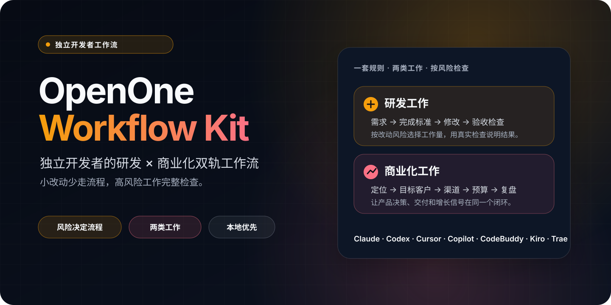
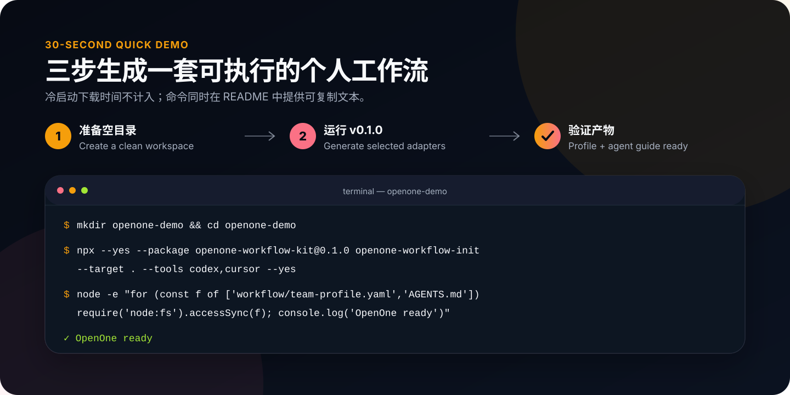
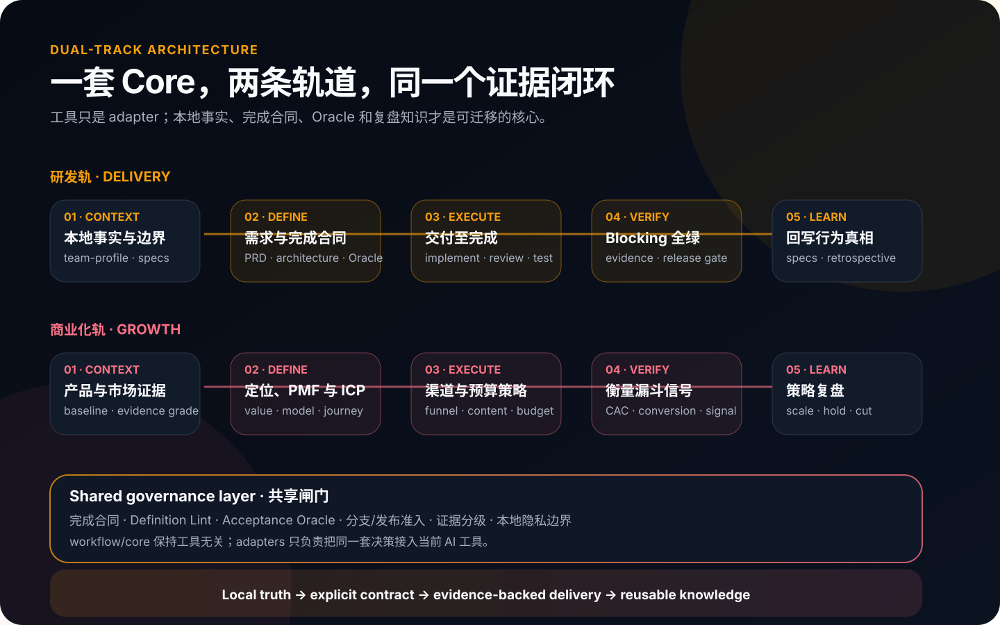

# OpenOne Workflow Kit

[](https://github.com/bluecoast1379/openone-workflow-kit/actions/workflows/check.yml)
[](https://www.npmjs.com/package/openone-workflow-kit)
[](./package.json)
[](./LICENSE)



OpenOne Workflow Kit 是给独立开发者使用的本地工作助手。你只要说清想改什么，agent 会根据风险选择合适的处理方式：小改动直接修改并做针对性检查，系统性或高风险改动先确认完成标准，再进行完整验证。

- **少走流程**：文案、bug 修复和单文件小改默认走短路径。
- **风险越高，检查越完整**：接口、数据、权限、发布配置等改动会自动提高检查强度。
- **结果说人话**：默认只说明改了什么、检查结果、剩余风险和是否需要你确认。
- **本地优先**：初始化器只读取本地资料并生成本地文件，不自动上传、推送、发布、部署或写入生产数据。
- **研发与商业化一起管理**：既能完成产品改动，也能维护定位、客户、渠道、预算和复盘。

本轮轻量化改造的范围和验收方式见[开发任务清单](./docs/development-task-checklist.md)。

## 如何选择

| 项目 | 适合谁 | 主要用途 |
| --- | --- | --- |
| [open-workflow-kit](https://github.com/bluecoast1379/open-workflow-kit) | 使用 AI Coding 的团队 | 多人协作、交付证据和跨工具管理 |
| [business-agent](https://github.com/bluecoast1379/business-agent) | 构建企业业务 Agent 的团队 | 业务规划、服务入口、评测与运行边界 |
| **openone-workflow-kit（本项目）** | **独立开发者** | **个人研发与商业化管理，并让流程强度跟随风险** |

## 第一次使用

前置条件是 Node.js 18+。在项目目录执行：

```bash
npx --yes --package openone-workflow-kit@1.1.0 openone-workflow-init \
  --target . --tools codex,claude,cursor --yes
```

`1.1.0` 包含风险自适应处理、白话入口和更短的固定上下文。需要复现旧版行为时，可使用不可变的 `v1.0.0` Tag 或 npm `1.0.0`。

初始化后可以直接用自然语言告诉 agent：

> 把设置页的保存按钮文案改成“保存更改”，完成后帮我检查一下。

或：

> 给账号删除功能增加二次确认。这会影响数据安全，请按完整方式处理，先和我确认完成标准。

你不需要记住一串命令。agent 会判断影响范围和风险；只有范围、风险或外部操作需要你决定时才会提问。

## 30 秒 Quick Demo

首次下载时间不计入 30 秒。在空目录中执行：

```bash
mkdir openone-demo && cd openone-demo
npx --yes --package openone-workflow-kit@1.1.0 openone-workflow-init --target . --tools codex,cursor --yes
node -e "for (const f of ['workflow/team-profile.yaml','workflow/policy.yaml','AGENTS.md']) require('node:fs').accessSync(f); console.log('OpenOne ready')"
```

预期结果是终端输出 `OpenOne ready`。如果 npm 网络不可用，参考 [Git 或本地 tarball 安装](./docs/shareable-install.md)。



## 一套规则，两类工作



1. `workflow/team-profile.yaml` 记录项目路径和本地事实，`workflow/policy.yaml` 记录默认处理方式。
2. `workflow/core/` 提供工具无关的阶段规则、完成标准、验收方法和模板。
3. 不同工具生成各自的本地入口，共享同一套基础规则。

## 两种处理方式

### 自动选择

新安装默认使用自动选择。低风险任务走“轻量处理”，发现风险时自动增加准备和检查：

1. 明确这次会改什么。
2. 集中完成修改。
3. 先查看改动是否符合目标。
4. 运行与改动直接相关的检查。
5. 汇总结果和剩余风险。

检查失败时，agent 最多进行两轮修复。仍未通过就会说明具体问题，不会无限重复。过程中不反复写进度文件，结束时统一记录一次。

以下情况会自动改用“完整检查”：对外接口或数据结构变化、账号与权限、安全、数据迁移、持续集成与部署流程（CI/CD）、生产配置、跨仓修改、不可逆操作，以及准备合并或发布。

### 完整检查

完整检查适合系统性改动、高风险改动和发布前核验。agent 会先整理目标、范围、失败情况和验收方式，请你确认完成标准，再实施和全面检查。

你可以随时明确说“这次做完整检查”。agent 不会自行降低你选择的检查强度。

无论使用哪一种方式，远程推送、正式发布、部署、生产写入、付费投放和对外联系仍然需要你明确授权。

## 初始化器会生成什么

1. `workflow/team-profile.yaml`：记录项目路径、技术栈线索和缺失资料。
2. `workflow/policy.yaml`：记录默认处理方式和自动升级条件。
3. `workflow/core/`：提供各阶段的通用规则和模板。
4. 各工具的本地入口，例如 Codex 的 `AGENTS.md` 与 `.agents/skills/`、Claude Code 的 `CLAUDE.md`、Cursor 的 `.cursor/`。
5. 必要资料缺失时，非交互模式会生成 `workflow/INITIALIZATION_QUESTIONS.md`，供你稍后补充。

初始化器不会执行远程 Git、构建部署、数据库写入或生产配置写入。生成后的工作助手可以在范围明确且目录状态安全时处理本地分支、提交、标签和合并；所有远程或生产动作继续等待你的明确授权。

## 需要时再用阶段入口

自然语言是默认入口。想明确指定阶段时，可以选择下面这些白话名称：

| 你会看到的名称 | 用途 | 兼容调用 ID |
| --- | --- | --- |
| 开始一个改动 | 建立本次改动的范围 | `/new-feature` |
| 讨论需求 | 梳理目标、用户和现有行为 | `/01-需求讨论` |
| 补充关键信息 | 消除会影响实现的歧义 | `/澄清` |
| 整理产品方案 | 记录交互与业务规则 | `/02-产品文档` |
| 明确界面方案 | 处理界面和体验要求 | `/02B-UI设计` |
| 评估技术方案 | 确认数据流、边界和失败处理 | `/03-技术架构` |
| 准备检查清单 | 写清如何证明改动正确 | `/06-测试用例` |
| 确认完成标准 | 汇总目标、范围和验收方式 | `/定义完成` |
| 开工前检查 | 检查不同文档之间是否矛盾 | `/一致性检查` |
| 开始修改 | 执行代码修改 | `/04-代码实现` |
| 完成这次改动 | 修改、检查、修复并给出最终结果 | `/交付至完成` |
| 检查代码改动 | 检查代码质量和风险 | `/05-代码审查` |
| 验证改动 | 运行验收和测试 | `/07-测试执行` |
| 准备发布 | 整理发布前清单 | `/08-发布准备` |
| 执行发布 | 在获得授权后执行发布步骤 | `/09-发布执行` |
| 总结这次工作 | 记录结果和经验 | `/10-复盘总结` |
| 查看进度 | 查看当前做到哪里 | `/workflow-status` |

旧调用 ID 不变，已有脚本和使用习惯可以继续工作。显示名称只是让选择入口和阅读结果更直观。

## 商业化工作

商业化部分用于回答“卖给谁、为什么买、在哪里找到客户、投入多少、效果怎样”。可以直接说：

> 为这个产品建立商业化基线，先从定位和理想客户开始。

首次可按业务定位、商业模式、客户画像、使用场景、渠道、获客策略、预算和渠道执行依次整理；上线后再按周期复盘。商业化工作默认只生成本地文档和清单，不会自行发布内容、购买广告或联系外部人员。

详见[双轨工作流设计](./docs/dual-track-workflow.md)。

## 其他安装方式

从源码 checkout 本地运行：

```bash
node /path/to/openone-workflow-kit/bin/init-workspace.cjs --target .
```

使用 shell wrapper：

```bash
/path/to/openone-workflow-kit/install.sh . --tools codex,claude,cursor
```

常用参数：

```bash
# 指定工具入口
node /path/to/openone-workflow-kit/bin/init-workspace.cjs --target . --tools codex,claude,cursor

# GitHub 包安装方式
npx --yes --package "git+https://github.com/bluecoast1379/openone-workflow-kit.git#v1.1.0" openone-workflow-init --target . --tools codex,claude,cursor

# 工具名支持 trea 别名，会自动归一为 trae
node /path/to/openone-workflow-kit/bin/init-workspace.cjs --target . --tools codex,trea,codebuddy

# 非交互模式；缺失资料写入待补问题文件
node /path/to/openone-workflow-kit/bin/init-workspace.cjs --target . --yes

# 只查看将生成什么，不写文件
node /path/to/openone-workflow-kit/bin/init-workspace.cjs --target . --dry-run
```

更多安装场景见[可分享安装方式](./docs/shareable-install.md)。

## 隐私与安全边界

本 kit 自身不应包含真实客户字段、内部系统地址、真实 URL 或凭证。对外分发前运行：

```bash
node openone-workflow-kit/bin/check-sanitized.cjs
```

个人项目的介绍、代码、设计资料和测试规范只在本地被引用。初始化器不把这些资料发送到外部服务。

## 从旧版本升级到 1.1.0

```bash
npx --yes --package openone-workflow-kit@1.1.0 openone-workflow-init \
  --target . --tools codex --upgrade --force --yes
```

升级会识别未修改的旧版生成文件，保留用户自定义内容。已有 `team-profile.yaml`、项目基本规则、个人规范、策略文件和同名自定义入口不会被静默覆盖；需要人工合并的新内容会写入 `.agent-workflow-new`。可先追加 `--dry-run` 查看计划。

旧工作区没有 `workflow/policy.yaml` 时，1.1.0 会补充默认值为“完整检查”的策略，避免升级后静默放宽原有流程；全新工作区默认使用“自动选择”。

## 高级兼容信息

这一节面向维护者、排障和审计场景；普通使用不需要理解这些名称。

### 内部名称与用户显示

| 旧版或内部名称 | 默认显示 |
| --- | --- |
| feature 容器 | 这次改动 / 需求文件夹 |
| 完成合同、合同冻结 | 完成标准、完成标准已确认 |
| Oracle | 验收项 |
| blocking Oracle | 必须通过的验收项 |
| Oracle 状态账本 | 验收记录 |
| Definition Lint | 完成标准检查 |
| gate / 闸门 | 开始条件或发布条件 |
| impact boundary | 这次会改什么、不会改什么 |
| precise blocker | 明确卡点 |
| S / M / L | 轻量改动 / 常规改动 / 高风险改动 |
| `NOT_RUN` | 未检查 |
| `PASS` / `FAIL` | 已通过 / 未通过 |
| `STALE` | 改动后需要重查 |
| `WAIVED` | 已确认作为例外跳过 |
| worktree | 独立开发目录 |
| constitution | 项目基本规则 |
| living specs | 已上线功能说明 |

内部文件名、字段和值暂时保留，以兼容已有工作区和校验脚本。用户可见的标题、说明和默认回复使用白话；只有技术详情模式才展示内部名称。

### Codex 与其他工具的入口兼容

Codex Desktop 可以输入 `/01`、`/B1` 等关键词，再从 `/` 面板选择对应的阶段 Skill；CLI/IDE 使用 `/skills` 或 `$workflow-...`。这属于 Skill 选择，不是 Claude 式字面项目命令。

命令元数据继续作为内部单一事实源，但用户标题与内部执行说明分开维护。工具 adapter 共享相同的用户标题，旧命令 ID 和 Skill slug 保持兼容。

`workflow/core/` 保持工具无关；不同工具共享同一套规则，但不承诺完全相同的交互体验。

## 维护与验证

- 通用规则修改在 `workflow/core/`。
- 个人项目配置修改在 `workflow/team-profile.yaml` 和 `workflow/policy.yaml`。
- 工具入口由初始化器或 adapter 生成，不在单个工具里复制业务规则。
- 对外发布前先运行脱敏检查，再由人工复核许可证、示例和文档。

本地检查：

```bash
cd /path/to/openone-workflow-kit
npm run check
```

本地打包：

```bash
cd /path/to/openone-workflow-kit
npm run build:release
```

打包只在 `dist/` 生成本地 tarball 和 `RELEASE_MANIFEST.md`，不会创建远程仓库、推送、打标签或发布 npm 包。

更多资料：[如何写清完成标准](./docs/definition-of-done.md) · [维护者交接](./docs/maintainer-handoff.md) · [手动发布指南](./docs/manual-publish.md) · [贡献说明](./CONTRIBUTING.md) · [安全报告](./SECURITY.md) · [行为准则](./CODE_OF_CONDUCT.md)
